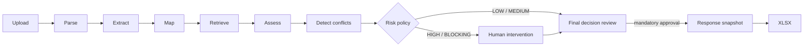
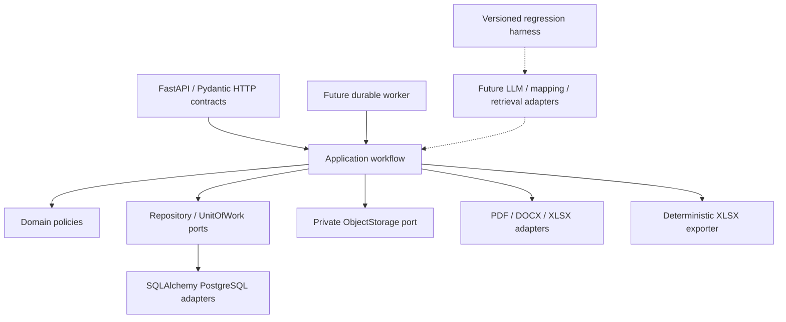
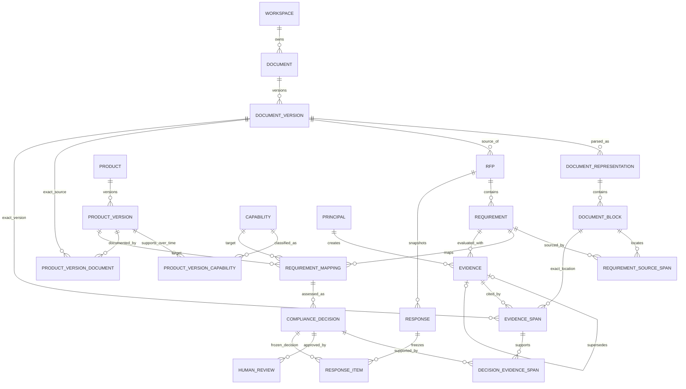

# CTRL v2 Stage 0/1.5 architecture

## Scope

This repository is a greenfield CTRL v2 application. Stage 1 intentionally implements manual
creation of extraction, mapping, evidence, and assessment artifacts. No LLM, retrieval engine,
vector database, agent framework, cloud platform, or CTRL v1 runtime code is present.

The target pipeline is straight-through:

Intermediate mappings are not mandatory review gates. Final approval is mandatory. LOW-risk
decisions can be batch-approved; HIGH/BLOCKING artifacts create targeted intervention work.

## Component boundaries

`domain` has no dependency on FastAPI, SQLAlchemy, parser libraries, or a provider. `application`
owns use-case and transaction orchestration and depends only on record/contracts plus Repository,
UnitOfWork, ObjectStorage, parser, and exporter ports. SQLAlchemy is confined to infrastructure.
The HTTP API and future worker are composition roots and must open every tenant transaction with
an explicit workspace context. Structured automation contracts and ports exist in `application`;
Stage 1.5 has no runtime adapters for them.

## Relationship graph

## Review and authority policy

Risk values are `LOW`, `MEDIUM`, `HIGH`, and `BLOCKING`. Current deterministic policy promotes an
artifact to HIGH for low confidence or ambiguity and to BLOCKING for a conflict or required
policy review. Strong/authoritative, high-confidence, unambiguous evidence is LOW.

Evidence source taxonomy is:

- `OFFICIAL_SPECIFICATION`
- `CERTIFICATION`
- `TEST_REPORT`
- `RELEASE_NOTES`
- `ROADMAP`
- `PREVIOUS_APPROVED_RESPONSE`
- `INTERNAL_NOTE`
- `OTHER`

Authority is recorded independently as `AUTHORITATIVE`, `STRONG`, `SUPPORTING`, `WEAK`, or
`UNVERIFIED`. This avoids hard-coding one authority score for every document of a source type.

## Temporal rules

- ProductVersion has `valid_from` and `valid_to`.
- A ProductVersion/Capability assignment has its own validity interval.
- Evidence has its own validity interval and an exact immutable DocumentVersion.
- ComplianceDecision records `assessment_as_of` and explicit scope bounds.
- Decision creation rejects an inapplicable ProductVersion or capability assignment.
- COMPLY/PARTIAL approval rejects evidence that is not applicable on `assessment_as_of`.
- A Response freezes the temporal assessment date and source hashes.

## Database enforcement

Every tenant-owned table uses a composite `(workspace_id, id)` primary key and composite foreign
keys for domain relations. PostgreSQL migration enables and forces RLS using a transaction-local
`app.workspace_id`. The application sets that value before every tenant query/command.

The migrations also install PostgreSQL triggers for:

- immutable DocumentVersion;
- immutable DocumentRepresentation and DocumentBlock once used by Evidence;
- immutable Evidence and EvidenceSpan once referenced by a decision;
- immutable approved ComplianceDecision;
- immutable evidence links of an approved decision;
- deferred enforcement that APPROVED COMPLY/PARTIAL has an EvidenceSpan resolving to an exact
  DocumentVersion;
- actor attribution for every newly inserted Evidence correction;
- append-only HumanReview, Response, ResponseItem and ResponseExport;
- deferred validation that every ResponseItem points to an approved decision and that positive
  decisions retain a complete relational provenance chain.

Evidence corrections create a new Evidence/EvidenceSpan pair and may reference exactly one prior
Evidence through `supersedes_id`; the prior row is never rewritten. Historical Evidence rows from
before this boundary retain a null actor explicitly rather than receiving fabricated attribution.
All new Evidence inserts require an authenticated Principal through both the application contract
and a PostgreSQL trigger.

Docker Compose separates a bootstrap administrator from a `NOSUPERUSER`, `NOCREATEDB`,
`NOCREATEROLE` application role. Both clean Alembic migration and PostgreSQL-specific integration
tests execute through the application role. The local SQLite test adapter is only a fast unit/API
feedback loop; it is not evidence for RLS, deferred constraints, or PostgreSQL trigger behavior.

## Evaluation architecture

The gold-dataset interface records manually reviewed source requirements, atomic requirements,
mappings, exact EvidenceSpans, and compliance outcomes. The CLI initializes an empty dataset,
validates it, or appends a complete reviewed case; it never generates synthetic cases. Versioned
evaluation run contracts record dataset, parser, extraction contract/prompt, model, retrieval,
decision prompt, and conflict prompt versions. The harness calculates:

- Atomic Requirement Recall;
- Evidence Recall@K;
- Compliance Accuracy;
- Critical False Comply Rate;
- Unedited Human Approval Rate.

Future automation promotion must compare a candidate run with an approved dataset baseline.
Capability bootstrap has a structured proposal port, but every proposed Capability remains
pending until human approval.

## Four MVP work surfaces

The frontend runtime is outside Stage 1. Its stable information architecture is:

1. **Projects** — RFP portfolio, status, risk summary, export history.
2. **Product Knowledge** — ProductVersions, temporal capability assignments, exact document
   versions, source types, authority and future capability proposals.
3. **New RFP** — secure upload, assessment date, product-version scope and processing launch.
4. **Assessment Workbench** — one integrated surface centered on:
   `Requirement -> ProductVersion -> Capability -> Decision -> Evidence -> Conflict -> approval`.

The Workbench supports evidence highlighting, confidence/risk filtering, targeted intervention,
and batch approval of eligible LOW-risk decisions.

## Production data-at-rest boundary

CTRL does not implement application-layer encryption or custom cryptography. Production startup
requires explicit deployment attestations that both PostgreSQL storage and the object-storage
volume/backend are encrypted at rest. These flags are operational gates, not cryptographic proof;
the deployment runbook must verify them against the selected infrastructure before setting them.
Backups must later receive equivalent protection.

The local filesystem adapter is create-only, publishes same-filesystem temporary files atomically,
and verifies SHA-256 plus byte size on every trusted read. Its root/directories are restricted to
the service account where the host filesystem supports POSIX-style modes. Production must mount
that root privately and grant the runtime service account only the minimum required filesystem
permissions. It must never be exposed as a static/public file mount.
